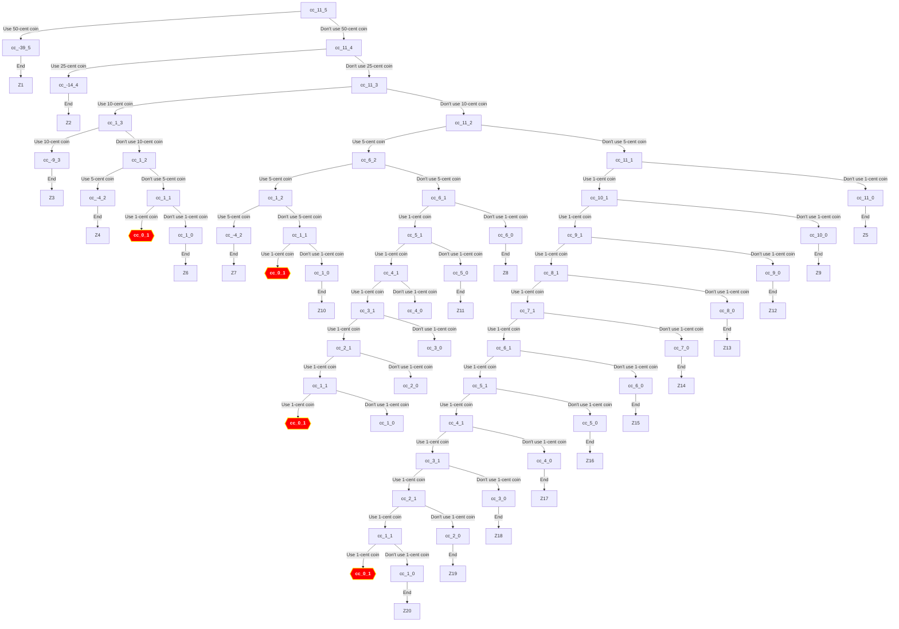

# Exercise 1.14
Draw the tree illustrating the process gen-erated by the count-change procedure of Section 1.2.2 in making change for 11 cents. What are the orders of growth of the space and number of steps used by this process as the amount to be changed increases?

```scheme
(define (count-change amount)
  (cc amount 5))

(define (cc amount kinds-of-coins)
  (cond
    [(= amount 0) 1]
    [(or (< amount 0)
         (= kinds-of-coins 0))
     0]
    [else
     (+ (cc amount (- kinds-of-coins 1))
        (cc (- amount
               (first-denomination
                kinds-of-coins))
            kinds-of-coins))]))

(define (first-denomination
         kinds-of-coins)
  (cond
    [(= kinds-of-coins 1) 1]
    [(= kinds-of-coins 2) 5]
    [(= kinds-of-coins 3) 10]
    [(= kinds-of-coins 4) 25]
    [(= kinds-of-coins 5) 50]))

```


